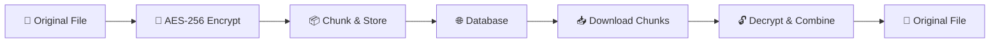

# 🔒 LocknDrop - Secure End-to-End Encrypted File Transfer

<div  align="center">


**Military-grade AES-256 encryption • Zero permanent storage • 24-hour auto-deletion**

[](https://www.lockndrop.asimsk.online)

[](https://en.wikipedia.org/wiki/Advanced_Encryption_Standard)

[](#security-architecture)

</div>

---

## 🚀 What is LocknDrop?

LocknDrop is a **secure, database-based file transfer application** that implements true end-to-end encryption. Unlike traditional file sharing services, your files are encrypted on your device before transmission and never stored in plaintext on our servers.

### ✨ Key Features

- 🔐 **True End-to-End Encryption** - Files encrypted with AES-256-GCM before leaving your device

- 🚫 **Zero Permanent Storage** - Files never stored in plaintext, automatic 24-hour deletion

- ⚡ **Instant Transfer** - Share files with a simple 6-character code

- 📱 **Cross-Platform** - Works on any device with a modern web browser

- 🌙 **Dark Mode Support** - Beautiful interface with light/dark themes

- 🔄 **Chunked Transfers** - Reliable transfer of large files up to 20MB

- 📊 **Real-time Progress** - Live transfer progress with speed indicators

- 🛡️ **Security Monitoring** - IP tracking for security analysis

---

## 🎯 Quick Start

### 🌐 Try It Now

Visit **[www.lockndrop.asimsk.online](https://www.lockndrop.asimsk.online)** to start transferring files securely!

### 📤 Sending Files

1. Click **"Send Files"**

2. Select your files (up to 20MB each)

3. Share the generated 6-character code

4. Files are automatically encrypted and uploaded

### 📥 Receiving Files

1. Click **"Receive Files"**

2. Enter the 6-character code

3. Files are automatically downloaded and decrypted

4. No registration or account required!

---

## 🏗️ Development Setup

### Prerequisites

- Node.js 18+ and npm

- Supabase account (for production)

### Installation

```bash

# Clone the repository

git  clone  https://github.com/asimar007/Lock-N-Drop.git

cd  Lock-N-Drop

# Install dependencies

npm  install

# Start development server

npm  run  dev
```

### Environment Configuration

Create a `.env` file:

```env

VITE_SUPABASE_URL=your_supabase_project_url

VITE_SUPABASE_ANON_KEY=your_supabase_anon_key

```

> **Note:** The app works in demo mode without Supabase for UI testing

---

## 🔒 Security Architecture

### End-to-End Encryption Flow



### Technical Security Details

| Component | Implementation |

| -------------------------- | -------------------------------------------- |

| **Encryption** | AES-256-GCM (Galois/Counter Mode) |

| **Key Generation** | Web Crypto API `crypto.subtle.generateKey()` |

| **Initialization Vectors** | Unique 96-bit IV per chunk |

| **Chunk Size** | 64KB for optimal performance |

| **Transport Security** | HTTPS/TLS 1.3 |

| **Data Retention** | Maximum 24 hours, typically 2 hours |

### Privacy Guarantees

- ✅ **Client-side encryption** - Keys never leave your device

- ✅ **Zero-knowledge server** - Server cannot decrypt your files

- ✅ **Automatic deletion** - All data purged within 24 hours

- ✅ **No file storage** - Only encrypted chunks stored temporarily

- ✅ **IP monitoring** - Security logs for threat detection

---

## 🛠️ Technology Stack

### Frontend

- **React 18** - Modern UI framework with hooks

- **TypeScript** - Type-safe development

- **Tailwind CSS** - Utility-first styling with dark mode

- **Lucide React** - Beautiful, consistent icons

- **Vite** - Fast development and building

### Backend & Database

- **Supabase** - PostgreSQL database with real-time features

- **Row Level Security** - Database-level access control

- **Edge Functions** - Serverless cleanup automation

- **Web Crypto API** - Browser-native encryption

### Security & Performance

- **AES-256-GCM** - Military-grade encryption

- **Chunked transfers** - Reliable large file handling

- **Progressive Web App** - Installable, offline-capable

- **Responsive design** - Mobile-first approach

---

### Automatic Cleanup System

- **Hourly**: Remove expired sessions (2+ hours old)

- **Daily**: Complete data purge (24-hour reset)

- **Permanent**: IP tracking for security monitoring

---

## 🤝 Contributing

We welcome contributions! Here's how to get started:

### Development Workflow

1.  **Fork** the repository

2.  **Create** a feature branch: `git checkout -b feature/amazing-feature`

3.  **Commit** your changes: `git commit -m 'Add amazing feature'`

4.  **Push** to the branch: `git push origin feature/amazing-feature`

5.  **Open** a Pull Request

### Code Standards

- **TypeScript** - Strict type checking enabled

- **ESLint** - Code linting and formatting

- **Prettier** - Consistent code style

- **Conventional Commits** - Semantic commit messages

### Testing

```bash

# Run linting

npm  run  lint

# Type checking

npx  tsc  --noEmit

# Build verification

npm  run  build
```

---

## 📄 License

This project is licensed under the **MIT License** - see the [LICENSE](LICENSE) file for details.

---

## 🛡️ Security

### Security Features

- 🔐 **End-to-end encryption** with AES-256-GCM

- 🚫 **Zero permanent storage** of user files

- ⏰ **Automatic data deletion** within 24 hours

- 🔍 **Security monitoring** with IP tracking

- 🛡️ **Row-level security** in database

- 🌐 **HTTPS enforcement** for all connections

---
