# 🔒 LocknDrop - Secure End-to-End Encrypted File Transfer

<div align="center">


**Military-grade AES-256 encryption • Zero permanent storage • 24-hour auto-deletion**

[](https://www.lockndrop.asimsk.online)
[](https://en.wikipedia.org/wiki/Advanced_Encryption_Standard)
[](#security-architecture)

</div>

---

## 🚀 What is LocknDrop?

LocknDrop is a **secure, database-based file transfer application** that implements true end-to-end encryption. Unlike traditional file sharing services, your files are encrypted on your device before transmission and never stored in plaintext on our servers.

### ✨ Key Features

- 🔐 **True End-to-End Encryption** - Files encrypted with AES-256-GCM before leaving your device
- 🚫 **Zero Permanent Storage** - Files never stored in plaintext, automatic 24-hour deletion
- ⚡ **Instant Transfer** - Share files with a simple 6-character code
- 📱 **Cross-Platform** - Works on any device with a modern web browser
- 🌙 **Dark Mode Support** - Beautiful interface with light/dark themes
- 🔄 **Chunked Transfers** - Reliable transfer of large files up to 20MB
- 📊 **Real-time Progress** - Live transfer progress with speed indicators
- 🛡️ **Security Monitoring** - IP tracking for security analysis

---

## 🎯 Quick Start

### 🌐 Try It Now
Visit **[www.lockndrop.asimsk.online](https://www.lockndrop.asimsk.online)** to start transferring files securely!

### 📤 Sending Files
1. Click **"Send Files"**
2. Select your files (up to 20MB each)
3. Share the generated 6-character code
4. Files are automatically encrypted and uploaded

### 📥 Receiving Files
1. Click **"Receive Files"**
2. Enter the 6-character code
3. Files are automatically downloaded and decrypted
4. No registration or account required!

---

## 🏗️ Development Setup

### Prerequisites
- Node.js 18+ and npm
- Supabase account (for production)

### Installation

```bash
# Clone the repository
git clone https://github.com/lockndrop/lockndrop.git
cd lockndrop

# Install dependencies
npm install

# Start development server
npm run dev
```

### Environment Configuration

Create a `.env` file:

```env
VITE_SUPABASE_URL=your_supabase_project_url
VITE_SUPABASE_ANON_KEY=your_supabase_anon_key
```

> **Note:** The app works in demo mode without Supabase for UI testing

---

## 🔒 Security Architecture

### End-to-End Encryption Flow

```mermaid
graph LR
    A[📁 Original File] --> B[🔐 AES-256 Encrypt]
    B --> C[📦 Chunk & Store]
    C --> D[🌐 Database]
    D --> E[📥 Download Chunks]
    E --> F[🔓 Decrypt & Combine]
    F --> G[📁 Original File]
```



### Technical Security Details

| Component | Implementation |
|-----------|----------------|
| **Encryption** | AES-256-GCM (Galois/Counter Mode) |
| **Key Generation** | Web Crypto API `crypto.subtle.generateKey()` |
| **Initialization Vectors** | Unique 96-bit IV per chunk |
| **Chunk Size** | 64KB for optimal performance |
| **Transport Security** | HTTPS/TLS 1.3 |
| **Data Retention** | Maximum 24 hours, typically 2 hours |

### Privacy Guarantees

- ✅ **Client-side encryption** - Keys never leave your device
- ✅ **Zero-knowledge server** - Server cannot decrypt your files
- ✅ **Automatic deletion** - All data purged within 24 hours
- ✅ **No file storage** - Only encrypted chunks stored temporarily
- ✅ **IP monitoring** - Security logs for threat detection

---

## 🛠️ Technology Stack

### Frontend
- **React 18** - Modern UI framework with hooks
- **TypeScript** - Type-safe development
- **Tailwind CSS** - Utility-first styling with dark mode
- **Lucide React** - Beautiful, consistent icons
- **Vite** - Fast development and building

### Backend & Database
- **Supabase** - PostgreSQL database with real-time features
- **Row Level Security** - Database-level access control
- **Edge Functions** - Serverless cleanup automation
- **Web Crypto API** - Browser-native encryption

### Security & Performance
- **AES-256-GCM** - Military-grade encryption
- **Chunked transfers** - Reliable large file handling
- **Progressive Web App** - Installable, offline-capable
- **Responsive design** - Mobile-first approach

---

## 📊 Database Schema

### Core Tables

```sql
-- Transfer sessions (10-minute expiry)
CREATE TABLE transfer_sessions (
  id uuid PRIMARY KEY,
  code text UNIQUE NOT NULL,
  status text DEFAULT 'waiting',
  expires_at timestamptz NOT NULL
);

-- File metadata with encryption keys
CREATE TABLE file_metadata (
  id uuid PRIMARY KEY,
  session_code text NOT NULL,
  file_name text NOT NULL,
  file_size bigint NOT NULL,
  encryption_key text NOT NULL,  -- AES-256 key
  total_chunks integer NOT NULL
);

-- Encrypted file chunks
CREATE TABLE file_chunks (
  id uuid PRIMARY KEY,
  file_id uuid REFERENCES file_metadata(id),
  chunk_index integer NOT NULL,
  chunk_data text NOT NULL,      -- Base64 encrypted data
  iv text NOT NULL               -- Unique IV per chunk
);
```

### Automatic Cleanup System

- **Hourly**: Remove expired sessions (2+ hours old)
- **Daily**: Complete data purge (24-hour reset)
- **Permanent**: IP tracking for security monitoring

---

## 🚀 Deployment

### Build for Production

```bash
# Build optimized production bundle
npm run build

# Preview production build locally
npm run preview
```

### Deployment Options

- **Netlify** - Automatic deployments from Git
- **Vercel** - Zero-config deployments
- **Static hosting** - Any CDN or web server
- **Self-hosted** - Docker containers available

### SEO & Performance

- ✅ **Sitemap.xml** - Search engine indexing
- ✅ **Robots.txt** - Crawler instructions
- ✅ **Open Graph** - Social media previews
- ✅ **Web Manifest** - PWA installation
- ✅ **Security headers** - HTTPS, CSP, HSTS
- ✅ **Compression** - Gzip/Brotli enabled

---

## 🔧 API Reference

### Cleanup Scheduler Edge Function

```bash
# Cleanup expired data
curl -X POST "https://your-project.supabase.co/functions/v1/cleanup-scheduler" \
  -H "Authorization: Bearer YOUR_ANON_KEY" \
  -H "Content-Type: application/json" \
  -d '{"type":"expired"}'

# Daily cleanup (24-hour reset)
curl -X POST "https://your-project.supabase.co/functions/v1/cleanup-scheduler" \
  -H "Authorization: Bearer YOUR_ANON_KEY" \
  -H "Content-Type: application/json" \
  -d '{"type":"daily"}'
```

### Database Functions

```sql
-- Manual cleanup operations
SELECT cleanup_expired_data_with_log();
SELECT cleanup_all_data_with_log();
SELECT is_daily_cleanup_due();

-- Security monitoring
SELECT * FROM user_ips ORDER BY last_seen DESC;
SELECT * FROM cleanup_statistics;
```

---

## 🤝 Contributing

We welcome contributions! Here's how to get started:

### Development Workflow

1. **Fork** the repository
2. **Create** a feature branch: `git checkout -b feature/amazing-feature`
3. **Commit** your changes: `git commit -m 'Add amazing feature'`
4. **Push** to the branch: `git push origin feature/amazing-feature`
5. **Open** a Pull Request

### Code Standards

- **TypeScript** - Strict type checking enabled
- **ESLint** - Code linting and formatting
- **Prettier** - Consistent code style
- **Conventional Commits** - Semantic commit messages

### Testing

```bash
# Run linting
npm run lint

# Type checking
npx tsc --noEmit

# Build verification
npm run build
```

---

## 📄 License

This project is licensed under the **MIT License** - see the [LICENSE](LICENSE) file for details.

---

## 🛡️ Security

### Reporting Security Issues

If you discover a security vulnerability, please email us at **security@lockndrop.asimsk.online** instead of using the issue tracker.

### Security Features

- 🔐 **End-to-end encryption** with AES-256-GCM
- 🚫 **Zero permanent storage** of user files
- ⏰ **Automatic data deletion** within 24 hours
- 🔍 **Security monitoring** with IP tracking
- 🛡️ **Row-level security** in database
- 🌐 **HTTPS enforcement** for all connections

---

## 📞 Support & Contact

- 🌐 **Website**: [www.lockndrop.asimsk.online](https://www.lockndrop.asimsk.online)
- 📧 **Email**: support@lockndrop.asimsk.online
- 🐛 **Issues**: [GitHub Issues](https://github.com/lockndrop/lockndrop/issues)
- 💬 **Discussions**: [GitHub Discussions](https://github.com/lockndrop/lockndrop/discussions)

---

## 🙏 Acknowledgments

- **Supabase** - For the excellent backend-as-a-service platform
- **React Team** - For the amazing frontend framework
- **Tailwind CSS** - For the utility-first CSS framework
- **Lucide** - For the beautiful icon library
- **Web Crypto API** - For browser-native encryption capabilities

---

<div align="center">

**Made with ❤️ for privacy and security**

[](https://github.com/lockndrop/lockndrop)
[](https://twitter.com/lockndrop)

</div>