# 🔒 LocknDrop - Secure End-to-End Encrypted File Transfer


**Serverless P2P File Transfer • Unlimited Speed • No File Size Limits**

[](https://www.lockndrop.asimsk.site)
[](https://webrtc-security.github.io/)
[](#security-architecture)

</div>

---

## 🚀 What is LocknDrop?

LocknDrop is a **secure, serverless peer-to-peer file transfer application**. Unlike traditional file sharing services, LocknDrop creates a direct connection between devices using **WebRTC**, meaning your files never touch a server. They stream directly from sender to receiver.

### ✨ Key Features

- 🔐 **Secure WebRTC Encryption** - All data is encrypted in transit using DTLS-SRTP.
- 🚫 **Zero Server Storage** - Files are never uploaded to any server.
- ⚡ **Unlimited Speed** - Direct device-to-device transfer. "Firehose" pipelining saturates your bandwidth.
- ♾️ **No File Size Limits** - Transfer gigabytes or terabytes. RAM-efficient streaming.
- 🧬 **Binary Protocol** - Custom raw binary framing for maximum efficiency (No Base64 overhead).
- 📱 **Cross-Platform** - Works on any device with a modern web browser.
- 🌙 **Dark Mode Support** - Beautiful interface with light/dark themes.
- 📊 **Real-time Progress** - Smooth 20fps progress indicators.

---

## 🎯 Quick Start

### 🌐 Try It Now

Visit **[www.lockndrop.asimsk.site](https://www.lockndrop.asimsk.site)** to start transferring files securely!

### 📤 Sending Files

1. Click **"Send Files"**.
2. Select your files (Unlimited size).
3. Share the generated 6-character code or Magic Link.
4. Files are automatically streamed P2P.

### 📥 Receiving Files

1. Click **"Receive Files"** (or open the Magic Link).
2. Enter the code.
3. Files are automatically downloaded.

---

## 🏗️ Development Setup

This project uses **Vite** and **React**. It requires **Node.js 18+**.

### Installation

```bash
# Clone the repository
git clone https://github.com/asimar007/Lock-N-Drop.git
cd Lock-N-Drop

# Install dependencies (We recommend Bun or npm)
bun install
# or
npm install

# Start development server
bun dev
# or
npm run dev
```

### Environment Configuration

No `.env` file is required! The project uses public PeerJS signaling (or you can host your own).

---

## 🔒 Security Architecture

### Peer-to-Peer Flow

```mermaid
graph LR
A[💻 Sender] -- Signaling (Handshake Only) --> B[☁️ PeerJS Server]
B -- Signaling (Handshake Only) --> C[📱 Receiver]
A -- 🔒 Encrypted Direct Stream (WebRTC) --> C
```



### Technical Security Details

| Component        | Implementation                       |
| ---------------- | ------------------------------------ |
| **Encryption**   | DTLS-SRTP (WebRTC Standard)          |
| **Protocol**     | Custom Binary Framing (Uint8Array)   |
| **Signaling**    | PeerJS Cloud (Ephemeral IDs only)    |
| **Data Channel** | SCTP over DTLS (Ordered, Reliable)   |
| **File Access**  | Streaming (In-Memory Processing)     |
| **Storage**      | None (Files are strictly RAM-to-RAM) |

### Privacy Guarantees

- ✅ **No Cloud Storage** - We physically cannot see your files.
- ✅ **No File Size Limits** - Since we don't store them, you can send anything.
- ✅ **Direct Transfer** - Data goes straight from Device A to Device B.
- ✅ **Ephemeral Sessions** - Connection closes immediately after transfer.

---

## 🛠️ Technology Stack

### Frontend & Core

- **React 18** - Modern UI framework with hooks
- **TypeScript** - Type-safe development
- **Vite** - Fast development and building
- **PeerJS** - WebRTC wrapper for simple P2P connections
- **Tailwind CSS** - Utility-first styling with dark mode
- **Lucide React** - Beautiful, consistent icons

### Architecture

- **Zero Backend** - Static site hosting only (Vercel/Netlify)
- **PeerJS Cloud** - Free public signaling server
- **Binary Protocol** - Custom `ArrayBuffer` packet framing for performance

---

## 🤝 Contributing

We welcome contributions! Here's how to get started:

### Development Workflow

1.  **Fork** the repository.
2.  **Create** a feature branch.
3.  **Commit** your changes.
4.  **Push** to the branch.
5.  **Open** a Pull Request.

### Testing

```bash
# Build verification
npm run build
```

---

## 📄 License

This project is licensed under the **MIT License** - see the [LICENSE](LICENSE) file for details.

---

## 🛡️ Security

### Security Features

- 🔐 **WebRTC Encryption** (DTLS-SRTP)
- 🚫 **Zero Server Storage**
- 🌐 **HTTPS enforcement**

---
